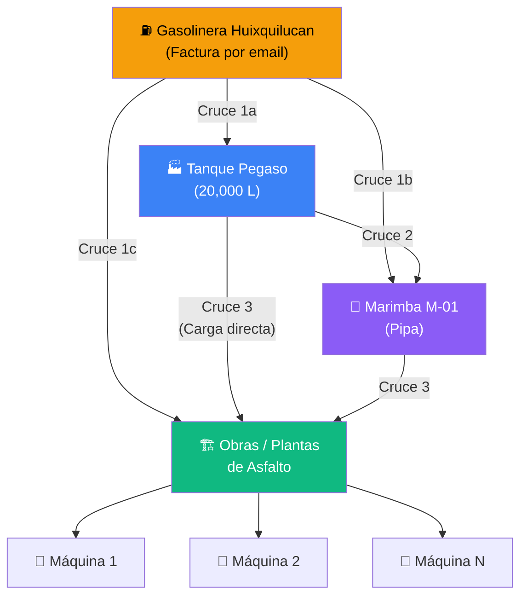
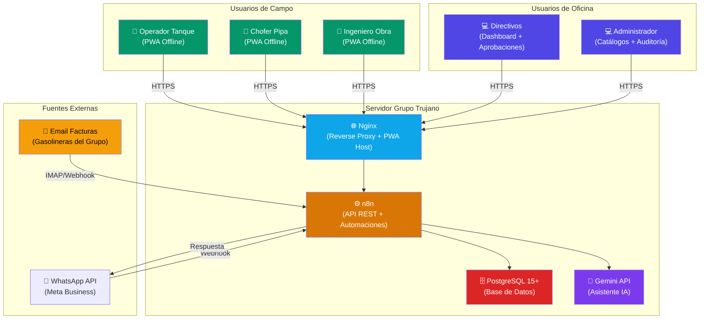

# Proyecto Fénix v2 — Sistema de Control y Trazabilidad de Diésel

## Contexto y Objetivo

Transformar el prototipo actual (HTML estático con datos mock/Supabase) en un **sistema de producción completo** alojado en los servidores propios de Grupo Trujano, con las siguientes capacidades:

1. **Captura en campo (mobile-first):** Ingenieros, operadores de tanque y choferes de pipa registran transacciones desde celular/laptop
2. **Offline-first con sincronización automática:** Funciona sin internet, sincroniza al reconectar
3. **Trazabilidad completa:** Desde gasolineras → Tanques (Pegaso/Huixquilucan) → Pipas (Marimba) → Obras / Plantas de Asfalto
4. **Conciliación en pareja:** Cada movimiento se registra por **ambas partes** (emisor y receptor) para cruce automático
5. **Solicitudes semanales con aprobación:** Ingenieros solicitan, directivos autorizan
6. **Rendimiento de maquinaria:** Seguimiento por obra vs. rendimiento esperado según vida útil
7. **Auditoría con facturas:** Las gasolineras reportan cargas vía factura por correo, cruzándose con las entradas reportadas en tanques
8. **Asistente virtual (IA):** Consultas en lenguaje natural por usuarios autorizados
9. **Backend n8n:** Automatizaciones, webhooks WhatsApp, reportes automáticos

---

## User Review Required

> [!IMPORTANT]
> **Infraestructura de servidores:** El plan asume que cuentan con un servidor Linux/Windows con:
> - PostgreSQL 15+ instalado (o disposición para instalarlo)
> - n8n auto-hospedado (ya mencionado)
> - Capacidad para servir una aplicación web (Nginx/Apache o IIS)
> - ¿Ya tienen un dominio o IP fija para acceso externo? Esto es necesario para que los ingenieros en campo accedan desde sus celulares.

> [!WARNING]
> **Migración de Supabase:** El esquema actual usa Supabase (cloud). Se migrará a PostgreSQL on-premise. Las políticas RLS de Supabase se reemplazarán por autenticación a nivel de API (n> [!IMPORTANT]
> **Plantas de Asfalto:** ✅ RESUELTO — Las plantas (Huixquilucan y Pegaso) usan el mismo formato GC-COMB-003 que las obras. Se tratan como tipo de obra "Planta" en el catálogo.

---

## Open Questions

> [!IMPORTANT]
> 1. **¿Qué servidor tienen disponible?** ¿Es Linux o Windows Server? ¿Qué recursos tiene (RAM, CPU, almacenamiento)?
> 2. **¿Ya tienen n8n instalado?** ¿En qué URL/puerto está accesible?
> 3. **¿Tienen dominio o IP pública fija?** Para acceso desde campo
> 4. **¿Cuántos usuarios aproximados usarán el sistema?** (~5 ingenieros + ~2 operadores + directivos = ~10-15 usuarios)
> 5. ~~¿Las plantas de asfalto usan el mismo formato?~~ ✅ Sí, usan GC-COMB-003
> 6. ~~¿El catálogo de rendimiento ya está en Excel?~~ ✅ Sí, hoja `Maquinaria_Inventario` y `Maquinaria_Calculo_Rendimiento` del Excel Maestro
> 7. ~~¿Quiénes son los roles que autorizan las solicitudes semanales?~~ ✅ Resuelto: Los directivos autorizan y modifican los topes por día/obra, y esto se manda a la gasolinera.les?** ¿Director General, Director de Operaciones, ambos?

---

## Modelo de Conciliación en Pareja

El corazón del sistema. Cada transferencia de combustible se registra por **ambas partes**, y el sistema cruza automáticamente para detectar discrepancias.

### Flujo Real de Combustible (basado en formatos Excel actuales)



> [!IMPORTANT]
> **Hallazgo del análisis de formatos:** La gasolinera NO solo carga al tanque. Según el formato GC-COMB-003, la Gasolinera Huixquilucan puede cargar **directamente** a: Tanque Pegaso, Marimba M-01 (pipa), u Obras/Plantas. También existe "Carga directa" del tanque a máquinas de obra sin pasar por pipa.

### Los 3 puntos de cruce de conciliación:

| Cruce | Emisor reporta | Receptor reporta | Verificación |
|-------|---------------|-----------------|---------------|
| **Cruce 1** | Factura de gasolinera (email) | Entrada reportada en **tanque, pipa, u obra/planta** | Litros facturados = Litros de entrada en cualquier punto receptor |
| **Cruce 2** | Operador de tanque reporta **salida** | Chofer de pipa reporta **entrada** | Litros despachados = Litros recibidos en pipa |
| **Cruce 3** | Operador de tanque o chofer de pipa reporta **salida** | Ingeniero de obra reporta **recepción** | Litros despachados = Litros recibidos en obra/planta |

> [!TIP]
> **Orígenes reales encontrados en los formatos:** Gasolinera Huixquilucan, Tanque Pegaso, Marimba M-01, Planta Asfalto Pegaso, Carga directa, Planta Asfaltos.

### Roles del sistema y qué reportan:

| Rol | Acceso al sistema | Qué reporta | Desde dónde |
|-----|------------------|-------------|-------------|
| **Operador de Tanque** | PWA (celular/laptop) | Entradas (carga desde gasolinera) + Salidas (despacho a pipa o directo a máquina) | Tanque fijo (Pegaso, Huixquilucan) |
| **Chofer de Pipa** | PWA (celular) | Entradas (carga desde tanque o gasolinera) + Salidas (despacho a obra/máquina) | En ruta / Obra |
| **Ingeniero de Obra** | PWA (celular/laptop) | Recepción de litros por máquina + horas/km trabajados + solicitud semanal | En obra |
| **Directivo** | PWA (laptop/PC) | Aprueba/rechaza solicitudes semanales + consulta dashboard + asistente IA | Oficina |
| **Administrador** | PWA (laptop/PC) | Gestión de catálogos + usuarios + auditoría completa | Oficina |
| **Gasolinera (externo)** | Email con factura adjunta | Factura XML/PDF de la carga | Por correo electrónico |

---

## Arquitectura Propuesta



---

## Proposed Changes

### Componente 1: Base de Datos Relacional (PostgreSQL On-Premise)

Se rediseña el esquema SQL para producción, eliminando dependencias de Supabase y añadiendo las entidades faltantes.

---

#### [NEW] [schema_v2.sql](file:///c:/Users/JOSE/Desktop/Proyecto fenix/schema_v2.sql)

Nuevo esquema completo de base de datos con las siguientes tablas:

| Grupo | Tabla | Descripción |
|-------|-------|-------------|
| **Usuarios y Roles** | `fenix_usuarios` | Usuarios del sistema con rol (operador_tanque, chofer_pipa, ingeniero, directivo, admin) |
| | `fenix_sesiones` | Tokens de sesión para autenticación |
| **Catálogos** | `fenix_obras` | 9 obras/plantas: MT, LT, CL, BT, PAP, PAH, DR, JAL + tipo (obra/planta) |
| | `fenix_equipos` | 40+ equipos reales con marca, modelo, año, serie, económico, dueño, rendimiento nuevo, unidad medida, operador asignado, obra asignada |
| | `fenix_gasolineras` | Gasolinera Huixquilucan (y futuras) |
| | `fenix_tanques` | Tanque Pegaso (20,000L) con operador asignado |
| | `fenix_pipas` | Marimba M-01 con chofer asignado |
| **Rendimiento** | Columnas en `fenix_equipos` | Rendimiento nuevo (L/h o km/L) + fórmula de desgaste 1% anual → rendimiento ajustado calculado |
| **Bitácoras** | `fenix_movimientos` | Tabla unificada con `par_id` + `lado` (EMISOR/RECEPTOR), `folio_ticket` auto-generado |
| | `fenix_horas_maquinaria` | Registro semanal de horas/km trabajados por equipo por obra (sección 3 del formato 003) |
| **Facturas** | `fenix_facturas_gasolinera` | Facturas por email para cruce con entradas en tanque, pipa u obra |
| **Solicitudes** | `fenix_solicitudes_semanales` | Cabecera con fecha solicitud, obra, solicitante |
| | `fenix_solicitud_detalle` | Detalle: equipo, litros solicitados por día (L-D), fecha de trabajo |
| | `fenix_autorizaciones` | Registro de autorización por directivo: Obra/Punto Carga, Litros Autorizados por Día, Estado enviado a Gasolinera |
| **Sincronización** | `fenix_sync_queue` | Cola offline |
| **WhatsApp/IA** | `fenix_whatsapp_inbox` | Mensajes recibidos de WhatsApp |
| **Auditoría** | `fenix_audit_log` | Log de todas las operaciones |
| **Conciliación** | `fenix_conciliacion_resultado` | Resultados de cruces 1, 2, 3 con estado y discrepancia |

**Datos reales pre-cargados (extraídos de los formatos Excel):**

- **9 obras/plantas:** México-Toluca (MT), Lerma-Tres Marías (LT), Chamapa-Lechería (CL), Bacheo Toluca (BT), Planta Asfalto Pegaso (PAP), Planta Asfalto Huixquilucan (PAH), Dragones (DR), Jalisco (JAL), No aplica (NA)
- **40+ equipos** con económico real: RT-01..05, VG-01..03, PR-01..02, BR-01..06, DR-01..04, TD-01, VC-01, NM-01..02, CPR-01..02, BG-01, CI-01..02, PT-01..02, PP-01
- **5 ingenieros:** Francisco Javier, Apolinar, Diego Carreola, Janeth, Luis
- **13+ operadores** con equipo y obra asignada
- **Rendimiento por equipo** con fórmula de desgaste anual del 1%

**Fórmula de rendimiento ajustado (del Excel Maestro):**
```
Para L/h (maquinaria): Rend. Ajustado = Rend. Nuevo × (1 + Edad × 0.01)
Para km/L (transporte): Rend. Ajustado = Rend. Nuevo / (1 + Edad × 0.01)
Edad = Año actual (2026) - Año fabricación. Default: 10 años si desconocido.
```

**Cambios clave respecto al esquema v1:**
- Se agrega sistema de usuarios con **5 roles específicos**
- **Tabla unificada `fenix_movimientos`** con `par_id` para conciliación en pareja
- **`fenix_equipos` expandida** con todos los campos del inventario real (marca, modelo, año, serie, dueño, rendimiento)
- **`fenix_horas_maquinaria`** nueva tabla para horas/km trabajados por semana (necesaria para calcular rendimiento real)
- **Folio de ticket auto-generado** con patrón `{OBRA}-{SEMANA}-{CONSECUTIVO}` (ej: LT-25-001)
- Se agrega `fenix_facturas_gasolinera` para cruce con entradas (en cualquier punto, no solo tanque)
- Plantas de asfalto como tipo de obra con formato 003
- Se agrega flujo de solicitud → aprobación con estados

#### Diseño de la tabla `fenix_movimientos` (Conciliación en Pareja)

En lugar de tablas separadas por tipo de punto (tanque, pipa, obra), se usa una **tabla unificada** donde cada transacción física genera **2 registros pareados**:

```sql
-- Ejemplo: Tanque Pegaso despacha 500L a Pipa Marimba
-- Registro 1 (EMISOR - Operador de tanque lo reporta)
INSERT INTO fenix_movimientos (par_id, lado, punto_tipo, punto_id, tipo_movimiento, litros, ...)
VALUES ('txn-abc', 'EMISOR', 'tanque', 'id-pegaso', 'salida', 500, ...);

-- Registro 2 (RECEPTOR - Chofer de pipa lo reporta)
INSERT INTO fenix_movimientos (par_id, lado, punto_tipo, punto_id, tipo_movimiento, litros, ...)
VALUES ('txn-abc', 'RECEPTOR', 'pipa', 'id-marimba', 'entrada', 500, ...);
```

El sistema cruza ambos registros por `par_id` y compara litros. Si hay diferencia → **alerta de discrepancia**.

> [!NOTE]
> Los registros pueden llegar en diferente momento (uno de los dos puede estar offline). El sistema detecta registros "huérfanos" (solo un lado reportado) y alerta para que se complete la pareja.

---

### Componente 2: API REST Backend (n8n Workflows)

n8n actuará como el backend completo, exponiendo endpoints REST que la PWA consume.

---

#### [NEW] [n8n_api_spec.md](file:///c:/Users/JOSE/Desktop/Proyecto fenix/n8n_api_spec.md)

Especificación de los endpoints REST que n8n expondrá:

| Método | Endpoint | Rol requerido | Descripción |
|--------|----------|---------------|-------------|
| **Autenticación** | | | |
| `POST` | `/api/auth/login` | Público | Autenticación de usuario (devuelve token + rol) |
| `POST` | `/api/auth/logout` | Cualquier rol | Cierre de sesión |
| **Catálogos** | | | |
| `GET` | `/api/catalogos/obras` | Cualquier rol | Listar obras activas |
| `GET` | `/api/catalogos/equipos` | Cualquier rol | Listar equipos |
| `GET` | `/api/catalogos/tanques` | Cualquier rol | Listar tanques |
| `GET` | `/api/catalogos/pipas` | Cualquier rol | Listar pipas |
| `GET` | `/api/catalogos/gasolineras` | Cualquier rol | Listar gasolineras del grupo |
| **Movimientos (Conciliación en Pareja)** | | | |
| `POST` | `/api/movimientos` | operador_tanque, chofer_pipa, ingeniero | Registrar movimiento (entrada o salida) con par_id |
| `GET` | `/api/movimientos?fecha=YYYY-MM-DD&punto=XX` | Cualquier rol | Consultar movimientos filtrados |
| `GET` | `/api/movimientos/huerfanos` | directivo, admin | Movimientos sin pareja (solo 1 lado reportado) |
| `GET` | `/api/movimientos/discrepancias` | directivo, admin | Pares con diferencia de litros |
| **Facturas de Gasolinera** | | | |
| `POST` | `/api/facturas` | admin | Registrar factura recibida por email |
| `GET` | `/api/facturas?periodo=YYYY-MM` | directivo, admin | Listar facturas con estado de cruce |
| **Solicitudes y Aprobaciones** | | | |
| `POST` | `/api/solicitudes` | ingeniero | Crear solicitud semanal unificada |
| `GET` | `/api/solicitudes/resumen` | directivo | Resumen consolidado de solicitudes por obra/día |
| `POST` | `/api/solicitudes/autorizar` | directivo | Modificar y autorizar litros por obra/día |
| `POST` | `/api/solicitudes/enviar-gasolinera`| Sistema | Enviar formato de autorización a gasolinera |
| **Sincronización** | | | |
| `POST` | `/api/sync` | Cualquier rol | Sincronización masiva (offline batch) |
| **Dashboard y Reportes** | | | |
| `GET` | `/api/dashboard/kpis` | directivo, admin | KPIs calculados |
| `GET` | `/api/dashboard/conciliacion` | directivo, admin | Resultados de cruces 1, 2 y 3 |
| `GET` | `/api/rendimiento/:equipo_id` | ingeniero, directivo | Rendimiento real vs esperado |
| **Asistente IA** | | | |
| `POST` | `/api/asistente` | directivo, admin | Consulta en lenguaje natural |
| **Webhooks Externos** | | | |
| `POST` | `/webhook/whatsapp` | Sistema | Webhook para mensajes de WhatsApp |
| `POST` | `/webhook/email-factura` | Sistema | Webhook para recepción de facturas por email |

---

### Componente 3: Aplicación Web PWA (Frontend)

Se reestructura completamente el frontend como una Progressive Web App con soporte offline.

---

#### [NEW] [manifest.json](file:///c:/Users/JOSE/Desktop/Proyecto fenix/manifest.json)

Manifiesto PWA para instalación en dispositivos móviles como app nativa.

#### [NEW] [sw.js](file:///c:/Users/JOSE/Desktop/Proyecto fenix/sw.js)

Service Worker con:
- **Cache de assets** (HTML, CSS, JS, fuentes, iconos)
- **Interceptación de requests** con estrategia Network-First + Cache Fallback
- **Cola de sincronización** usando IndexedDB: cuando no hay red, las transacciones se almacenan localmente y se envían automáticamente al reconectar (Background Sync API)
- **Notificaciones push** para alertas de aprobación

#### [MODIFY] [index.html](file:///c:/Users/JOSE/Desktop/Proyecto fenix/index.html)

Reestructuración completa:
- Agregar registro del Service Worker y manifiesto PWA
- Nuevo sistema de navegación mobile-first con bottom tabs
- Pantalla de login para autenticación (la UI se adapta según el rol del usuario)
- **Vista Operador de Tanque:**
  - Registrar ENTRADA (carga desde gasolinera) → litros, gasolinera, factura, foto de medidor
  - Registrar SALIDA (despacho a pipa o directo a máquina) → litros, destino, par_id
- **Vista Chofer de Pipa:**
  - Registrar ENTRADA (carga desde tanque o gasolinera) → litros, origen, par_id
  - Registrar SALIDA (despacho a obra/máquina) → litros, obra, máquina, par_id
- **Vista Ingeniero de Obra:**
  - Registrar RECEPCIÓN de litros por máquina → litros, máquina, horas/km, actividad, foto, par_id
  - Crear solicitud semanal unificada (matriz Equipo vs Días de la semana)
- **Vista Directivo:**
  - Dashboard de conciliación con cruces 1, 2 y 3
  - **Módulo de Autorización de Combustible:** Resumen por obra de litros solicitados por día. Permite modificar los litros autorizados por día y generar el pase para la gasolinera.
  - Consultar rendimiento de maquinaria
  - Asistente IA
- **Vista Admin:**
  - Gestión de catálogos (obras, equipos, tanques, pipas, gasolineras, usuarios)
  - Registro de facturas de gasolinera
  - Auditoría completa
- Indicador de estado de conexión visible permanentemente
- Indicador de transacciones pendientes de sincronizar
- Badge de movimientos "huérfanos" (pendientes de pareja)

#### [MODIFY] [style.css](file:///c:/Users/JOSE/Desktop/Proyecto fenix/style.css)

- Diseño responsive mobile-first completo
- Bottom navigation bar para móvil
- Formularios optimizados para touch (inputs grandes, botones amplios)
- Indicadores de estado de red (online/offline/syncing)
- Tema oscuro premium con glassmorphism

#### [MODIFY] [app.js](file:///c:/Users/JOSE/Desktop/Proyecto fenix/app.js)

Reestructuración completa de la lógica:
- **Módulo de autenticación:** Login/logout con tokens
- **Módulo de sincronización offline:**
  - IndexedDB como base de datos local
  - Cola de transacciones pendientes
  - Detección automática de conectividad
  - Sincronización automática al reconectar
  - Resolución de conflictos (última escritura gana)
- **Módulo de captura:** Formularios de bitácora con validación
- **Módulo de solicitudes:** Crear, consultar, aprobar solicitudes semanales
- **Módulo de rendimiento:** Cálculo y visualización de rendimiento real vs esperado
- **Módulo de dashboard:** KPIs y gráficas de conciliación
- **Módulo de asistente IA:** Chat con el backend n8n/Gemini
- Eliminar dependencia directa de Supabase SDK (toda comunicación vía n8n API)

#### [NEW] [db.js](file:///c:/Users/JOSE/Desktop/Proyecto fenix/db.js)

Módulo de IndexedDB para almacenamiento local offline:
- Stores: `transacciones_pendientes`, `catalogos_cache`, `sesion`, `bitacoras_cache`
- Métodos: `guardarLocal()`, `obtenerPendientes()`, `marcarSincronizado()`, `limpiarCache()`

#### [NEW] [sync.js](file:///c:/Users/JOSE/Desktop/Proyecto fenix/sync.js)

Módulo de sincronización:
- Detector de conectividad (`navigator.onLine` + ping al servidor)
- Cola FIFO de transacciones
- Reintentos con backoff exponencial
- Sincronización bidireccional (push local → server, pull server → local)
- Evento visual de progreso de sincronización

#### [NEW] [auth.js](file:///c:/Users/JOSE/Desktop/Proyecto fenix/auth.js)

Módulo de autenticación:
- Login con usuario/contraseña
- Almacenamiento seguro del token en IndexedDB
- Middleware que agrega el token a todas las peticiones API
- Auto-logout al expirar sesión
- Control de vistas según rol del usuario

---

### Componente 4: Datos Maestros Pre-cargados y Rendimiento

---

#### [NEW] [datos_iniciales.sql](file:///c:/Users/JOSE/Desktop/Proyecto fenix/datos_iniciales.sql)

Script SQL con todos los datos reales extraídos de los formatos Excel:

**Catálogo de equipos con rendimiento (muestra de los 40+ equipos reales):**

```sql
INSERT INTO fenix_equipos 
  (economico, tipo_unidad, marca, modelo, anio, num_serie, dueno, rendimiento_nuevo, unidad_medida)
VALUES
  ('RT-01', 'Retroexcavadora', 'CASE', '580 N', 2011, 'JJGN580NABC540211', 'Trituradora Roca Dura', 6.50, 'L/h'),
  ('VG-01', 'Pavimentadora', 'VOGELE', '1800-3 i', 2016, '14821687', 'JDJ Equipo y Construcciones', 14.50, 'L/h'),
  ('PR-01', 'Perfiladora', 'RODATEC', 'RX600-4-4008', 2015, '79816538', 'JDJ Equipo y Construcciones', 65.00, 'L/h'),
  ('BR-01', 'Barredora', 'BROCE', 'RJ350', 2010, '89602', 'JDJ Equipo y Construcciones', 7.50, 'L/h'),
  ('DR-01', 'Doble Rodillo', 'HAMM', '120HD VV', 2010, 'H1840093', 'Trituradora Roca Dura', 12.00, 'L/h'),
  ('NM-01', 'Neumático', 'DINAPAC', 'CP271', 2010, '23620561', 'Trituradora Roca Dura', 9.50, 'L/h'),
  ('CI-01', 'Impacto', 'FORD', '4300', 2013, '1HTMMAAL2DH158631', 'JDJ Equipo y Construcciones', 3.50, 'km/L'),
  ('BG-01', 'Transfer Buggy', 'RODATEC', NULL, NULL, 'CB-2500B 538', NULL, 30.00, 'L/h'),
  -- ... 32+ equipos más
```

**El rendimiento ajustado se calcula automáticamente:**
```sql
-- Vista o columna calculada
rendimiento_ajustado = CASE 
  WHEN unidad_medida = 'L/h' THEN rendimiento_nuevo * (1 + (edad_anios * 0.01))
  WHEN unidad_medida = 'km/L' THEN rendimiento_nuevo / (1 + (edad_anios * 0.01))
END
```

**Para calcular rendimiento real semanal:**
```
Rendimiento Real (L/h) = Total litros recibidos en semana / Total horas trabajadas en semana
Desviación = Rendimiento Real - Rendimiento Ajustado
Si Desviación > umbral → ALERTA de consumo excesivo
```

---

### Componente 5: Flujo Unificado de Solicitud y Autorización de Diésel

Tras analizar los formatos dispares de solicitud (Toluca, Huixquilucan, Pegaso), se unifica el flujo:

#### 1. Formato Unificado de Captura (Ingeniero)
En la PWA, el ingeniero llenará una matriz estándar:
- **Filas:** Equipos asignados a la obra
- **Columnas:** Días de la semana (Lunes a Domingo)
- **Valores:** Litros solicitados

#### 2. Resumen de Modificación y Autorización (Directivos)
Los directivos verán un resumen consolidado **por Obra/Punto de Carga**, no por equipo individual.
- Ven: Total solicitado por día por Obra (ej. Lunes: 660L, Martes: 380L).
- Acción: Pueden **modificar el tope autorizado** por día (ej. autorizar solo 550L el Lunes).

#### 3. Envío a Gasolineras (El "Pase")
Una vez que el directivo autoriza, n8n genera automáticamente un PDF o Excel equivalente al formato `Autorizacion_Diesel_Semana_22` y lo envía por correo/WhatsApp a la gasolinera.
- El formato indica: Punto de Carga (ej. Unidad Marimba, Planta Huixquilucan) → Destino → Lts Diarios Autorizados → Total Semanal.
- Esto establece el **límite máximo** que la gasolinera puede despachar.

---

### Componente 6: Flujos n8n (Arquitectura Multiagente)

---

#### [MODIFY] [n8n_workflows_guide.md](file:///c:/Users/JOSE/Desktop/Proyecto fenix/n8n_workflows_guide.md)

Para mantener la base de datos prístina a largo plazo, **no se usarán flujos lineales tradicionales**. Se implementará una **Arquitectura Multiagente** utilizando los nodos avanzados de IA de n8n (LangChain / Sub-agentes). Cada solicitud entrante pasará por un filtro de calidad de datos y conciliación contextual antes de inyectarse a PostgreSQL.

| Agente / Flujo | Trigger | Responsabilidad (IA + Reglas) |
|----------------|---------|-----------------------------|
| **Agente Router (Gateway)** | Webhook HTTP | Recibe todos los payloads de la PWA. Usa IA para clasificar el tipo de operación, validar el JSON y enrutar al agente especialista adecuado. |
| **Agente de Calidad de Datos** | Router | Valida que los datos ingresados tengan sentido físico (ej. que las horas de maquinaria no excedan las horas del día, que los litros sean coherentes con el histórico del equipo). Filtra errores de "dedo". |
| **Agente Conciliador (Contextual)** | Router / Cron | No solo hace un matching estricto por `par_id`. Analiza discrepancias con contexto (ej. "Hay una diferencia de 5 litros, pero la observación dice 'derrame al conectar manguera', clasificar como MERMA en vez de ALERTA CRÍTICA"). |
| **Agente Lector de Facturas** | IMAP Trigger | Lee facturas por email (PDF/XML). Usa IA para extraer litros, tipo de combustible, estación y fecha de forma semántica, sin depender de plantillas fijas que se rompen si la gasolinera cambia su formato. |
| **Flujo de Autorización Gasolinera** | POST API | Tras la autorización del directivo, este agente redacta el correo con el tope máximo y genera el PDF de forma dinámica. |
| **Asistente Analítico** | POST `/api/asistente` | Conectado a herramientas SQL (SQL Agent), procesa consultas en lenguaje natural del directivo sobre consumos, tendencias y KPIs. |

---

## Transición Orgánica: Excel → Sistema Fénix

> [!TIP]
> Los formularios del sistema replican **exactamente** las columnas de los formatos Excel actuales para que la transición sea natural.

| Formato Excel | → Pantalla del Sistema | Mismos campos |
|--------------|----------------------|---------------|
| GC-COMB-006 Hoja "Captura Pegaso" | Vista Operador de Tanque | Folio, Fecha, Hora, Origen, Destino, Obra, Litros, Observaciones |
| GC-COMB-006 Hoja "Captura Marimba" | Vista Chofer de Pipa | Folio, Fecha, Hora, Origen, Destino, Obra, Litros, Firma, Observaciones |
| GC-COMB-003 Sección 1 (Recibido) | Vista Ingeniero: Recepción | Día, Fuente, Litros Recibidos |
| GC-COMB-003 Sección 2 (Distribución) | Vista Ingeniero: Distribución | Folio, Fecha, Hora, Origen, Destino Maquinaria, Económico, Litros, Operador |
| GC-COMB-003 Sección 3 (Horas) | Vista Ingeniero: Horas de Maquinaria | Maquinaria, Lun-Sáb, Total Horas |
| Hoja "Solicitudes" del Maestro | Módulo de Solicitudes | Fecha Solicitud, Obra, Fecha Trabajo, Equipo, Litros, Costo, Solicitante |
| Hoja "Dashboard" del Maestro | Dashboard de Conciliación | KPIs, Comparativa Solicitado vs Entregado, Conciliación por Obra |
| Hoja "Conciliacion" del Maestro | Motor de Conciliación en Pareja | Despachado Marimba vs Pegaso vs Recibido en Obra |

---

## Fases de Implementación (MVP First)

> [!IMPORTANT]
> **Enfoque MVP:** Entregar primero la captura y conciliación básica que reemplace los Excel, para abrir puertas a automatizar más procesos del grupo.

### Fase 1: Base de Datos + Datos Iniciales (Esta sesión)
1. ✅ Diseñar esquema SQL v2 completo
2. ✅ Analizar formatos Excel y extraer catálogos reales
3. Crear `schema_v2.sql` con todas las tablas
4. Crear `datos_iniciales.sql` con los 9 obras, 40+ equipos, ingenieros, operadores
5. Documentar guía de instalación del servidor

### Fase 2: MVP Frontend — Captura en Campo (reemplazo de Excel)
1. PWA con manifest + service worker básico
2. Login simple (usuario + contraseña)
3. **Vista Operador Tanque** — réplica del formato GC-COMB-006 Pegaso
4. **Vista Chofer Pipa** — réplica del formato GC-COMB-006 Marimba
5. **Vista Ingeniero** — réplica del formato GC-COMB-003 (recepción + distribución + horas)
6. Folio auto-generado `{OBRA}-{SEMANA}-{CONSECUTIVO}`
7. IndexedDB para offline + sincronización automática

### Fase 3: Orquestación Multiagente (n8n API)
1. Desplegar nodos de IA / LangChain en n8n
2. Construir el **Agente Router** para recibir las transacciones de la PWA y validarlas semánticamente
3. Construir el **Agente de Calidad de Datos** para filtrar errores antes de PostgreSQL
4. Implementar endpoint de sincronización masiva manejado por los agentes
5. Autenticación básica con tokens

### Fase 4: Agente Conciliador y Dashboard
1. Desarrollar el **Agente Conciliador Contextual** para evaluar cruces (1, 2, 3) y discrepancias
2. Dashboard ejecutivo (réplica del Excel Maestro) con alertas semánticas del Agente
3. Comparativa Solicitado vs Entregado vs Autorizado

### Fase 5: Solicitudes y Autorizaciones
1. Formulario unificado de solicitud semanal (Matriz Equipo x Días)
2. Flujo de autorización para directivos (modificación de topes por día/obra)
3. Workflow en n8n para generación de PDF de Autorización
4. Envío automático a Gasolineras (email)

### Fase 6: Rendimiento + Asistente IA + WhatsApp
1. Cálculo automático de rendimiento real vs ajustado
2. Alertas de consumo excesivo por equipo
3. Integración del asistente IA con Gemini
4. Flujo de WhatsApp con análisis multimodal
5. Reportes automáticos diarios/semanales
6. Receptor de facturas de gasolinera por email

---

## Verification Plan

### Automated Tests
- Test de conexión a PostgreSQL desde n8n
- Test de endpoints API con datos de prueba
- Test de sincronización offline → online con datos simulados
- **Test de conciliación en pareja:** Simular 2 reportes (emisor + receptor) y verificar cruce
- **Test de huérfanos:** Solo 1 lado reportado → verificar alerta
- **Test de discrepancias:** 2 reportes con litros diferentes → verificar detección
- **Test de rendimiento:** Comparar litros/horas contra rendimiento ajustado → verificar alerta si excede umbral

### Manual Verification
- **Escenario completo de campo:**
  1. Operador de tanque registra entrada (carga de gasolinera) → verificar cruce con factura
  2. Operador de tanque registra salida (despacho a pipa) → verificar huérfano
  3. Chofer de pipa registra entrada (desde tanque) → verificar que completa la pareja
  4. Chofer de pipa registra salida (a obra) → verificar huérfano
  5. Ingeniero de obra registra recepción → verificar que completa la pareja
  6. Ingeniero registra horas de maquinaria → verificar cálculo de rendimiento real
- **Escenario de carga directa:** Gasolinera → Planta Asfalto Pegaso (sin tanque ni pipa)
- Probar la PWA en celular real en campo (con y sin internet)
- Verificar sincronización offline → online
- Comparar reportes del sistema vs los Excel que ya generan para validar que los números coinciden
- Probar solicitud → aprobación por directivo
- Verificar que el dashboard replica los mismos datos que el Excel Maestro
