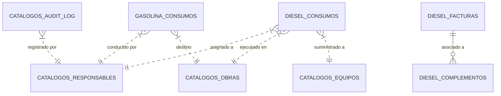
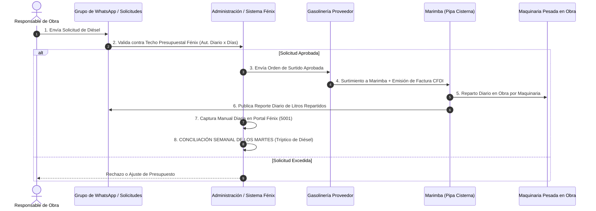

# 📋 DOCUMENTO DE PROCEDIMIENTO Y ARQUITECTURA DEL SISTEMA FÉNIX 2.0
**Alineación Estratégica para Certificación ISO 9001:2015 (Calidad) e ISO 14001:2015 (Gestión Ambiental)**

---

| CONTROL DOCUMENTAL | DATOS DE REGISTRO |
| :--- | :--- |
| **Código del Documento** | `PR-IT-001-FENIX` |
| **Título del Procedimiento** | Procedimiento de Operación, Arquitectura de Software y Control de Información del Sistema Fénix 2.0 |
| **Versión** | `2.0` (Agosto 2026) |
| **Elaboró** | Equipo de Desarrollo y Sistemas Fénix |
| **Revisó / Aprobó** | Dirección General / Comité de Certificación ISO 9001 e ISO 14001 |
| **Aplica para** | Grupo Trujano — Control de Combustibles, Acarreos, Mezcla Asfáltica y Telepeaje |

---

## 1. 🎯 OBJETIVO Y ALCANCE

### 1.1 Objetivo General:
Establecer el procedimiento normado de operación, la arquitectura tecnológica de origen, la estructura de la base de datos relacional y el funcionamiento integral de los módulos de captura y administración del **Sistema Fénix 2.0**, sirviendo como base técnica obligatoria para las auditorías de certificación en **ISO 9001:2015** e **ISO 14001:2015** en México.

### 1.2 Alcance para ISO 9001 (Sistema de Gestión de Calidad):
- **Cero Errores en Facturación y Pago**: Conciliación matemática al centavo entre solicitudes, facturas de proveedores/gasolinerías y consumos reales entregados a la maquinaria.
- **Trazabilidad Inalterable**: Registro de cada carga con folio, fecha, responsable, obra y unidad económica.
- **Control de Información Documentada**: Historial inalterable de auditoría (`catalogos.audit_log`) que registra quién creó, modificó o eliminó cualquier dato.

### 1.3 Alcance para ISO 14001 (Sistema de Gestión Ambiental):
- **Control de Hidrocarburos**: Monitoreo estricto del almacenamiento, transporte (en "Marimbas"/pipas) y despacho de diésel y gasolina.
- **Prevención de Fugas y Mermas**: Identificación temprana de diferencias entre el volumen comprado a la gasolinería y el volumen entregado a las máquinas.
- **Eficiencia Energética**: Control de techos de consumo autorizados por responsable y obra.

---

## 🏗️ 2. ORIGEN, BASES TECNOLÓGICAS Y DE QUÉ DEPENDE EL SISTEMA

### 2.1 Origen y Fundamento:
El Sistema Fénix nace para reemplazar la captura en hojas de papel dispersas y planillas aisladas, creando una plataforma web centralizada capaz de procesar millones de litros de combustible y miles de boletas de acarreo sin margen de error humano.

### 2.2 Lenguajes y Stack Tecnológico:
- **Backend / Lógica de Servidor**: Python 3.12 con el micro-framework **Flask**. Elección basada en su alta velocidad de procesamiento, manejo nativo de datos y facilidad de integración con librerías de análisis (`pandas`, `openpyxl`, `reportlab`, `psycopg2`).
- **Frontend / Interfaz de Usuario**: HTML5 semántico, CSS3 moderno (*Aesthetic Glassmorphism* con paletas oscuras responsivas de alto contraste) y JavaScript puro (Vanilla JS) para autocompletado en 0ms sin sobrecarga de frameworks externos.
- **Procesamiento de Documentos**: `openpyxl` (para lectura y generación de hojas Excel complejas con fórmulas y estilos), `reportlab` (para la generación de reportes ejecutivos oficiales en PDF) y `pdfplumber` (para la lectura inteligente de bitácoras en PDF).

---

## 🗄️ 3. ARQUITECTURA DE LA BASE DE DATOS RELACIONAL (`fenix_db`)

El sistema depende de una base de datos relacional cliente-servidor **PostgreSQL 16** alojada localmente en el servidor (`localhost:5432`), garantizando integridad referencial, transacciones ACID y altísima velocidad de respuesta.



### 3.1 Esquemas Principales de la Base de Datos:

1. **Esquema `diesel`**:
   - `diesel.consumos`: Almacena cada carga de diésel (id, fecha, semana, responsable, equipo_economico, obra, litros, costo_litro, importe_total, marimba_pipa, origen, observaciones).
   - `diesel.facturas`: Facturas de proveedores de diésel (UUID, emisor, folio, subtotal, iva, total, estatus_pago).
   - `diesel.complementos_pago`: Registro de Complementos de Pago SAT (CFDI) aplicados a facturas.
   - `diesel.solicitudes`: Peticiones formales de saldo y volumen de diésel por obra.

2. **Esquema `gasolina`**:
   - `gasolina.consumos`: Bitácora de cargas de unidades ligeras (id, fecha, semana, conductor, vehiculo, placa, obra_destino, litros, costo_por_litro, importe_total, gasolineria, folio_conciliacion, origen).
   - `gasolina.autorizaciones_maestro`: Padrón oficial de vehículos y placas con su conductor y obra asignada (utilizado para el autocompletado en 0ms).
   - `gasolina.autorizaciones_semanal`: Presupuestos y topes de litros semanales por ingeniero.

3. **Esquema `catalogos`**:
   - `catalogos.responsables`: Padrón de ingenieros responsables. Incluye la columna normada `dias_trabajados` (6 Días vs 5 Días) y `autorizado_diario`.
   - `catalogos.obras`: Lista maestra de centros de trabajo y proyectos.
   - `catalogos.equipos`: Registro de maquinaria pesada, vehículos y números económicos.
   - `catalogos.audit_log`: Tabla de auditoría inalterable (tabla_afectada, registro_id, usuario, accion, valor_anterior, valor_nuevo, fecha_hora).

4. **Esquemas `acarreos`, `mezcla` y `tags`**:
   - `acarreos.viajes`: Registro de viajes de materiales y fresado (cubicaje, camion, boleta, obra).
   - `mezcla.produccion`: Toneladas de mezcla asfáltica producida y tirada en obra.
   - `tags.movimientos`: Afectación de casetas de telepeaje (Pásalo, IAVE, Viapass, Televía).

---

## 💻 4. ESTRUCTURA Y FUNCIONAMIENTO DEL FRONTEND (PÁGINAS Y PESTAÑAS)

El sistema opera mediante una **Arquitectura de Doble Portal** para separar la operación de campo del control administrativo:

```
                  ┌─────────────────────────────────────────┐
                  │          SISTEMA FÉNIX 2.0             │
                  └────────────────────┬────────────────────┘
                                       │
            ┌──────────────────────────┴──────────────────────────┐
            ▼                                                     ▼
┌──────────────────────┐                              ┌──────────────────────┐
│  PORTAL DE CAPTURA   │                              │   CENTRO DE MANDO    │
│    (Puerto 5001)     │                              │ ADMINISTRATIVO (5002)│
└───────────┬──────────┘                              └───────────┬──────────┘
            │                                                     │
 ┌──────────┴──────────┐                               ┌──────────┴──────────┐
 │ • Diésel            │                               │ • Resumen Dashboard │
 │ • Gasolina          │                               │ • Consumo Semanal   │
 │ • Jalisco           │                               │ • Facturas & SAT    │
 │ • Solicitudes       │                               │ • Catálogos         │
 │ • Acarreos & Mezcla │                               │ • Telepeaje Tags    │
 └─────────────────────┘                               └─────────────────────┘
```

---

### 4.1 PORTAL DE CAPTURA OPERATIVA (`http://localhost:5001`)

Diseñado para uso en obra y estaciones de despacho. Ofrece una interfaz de alta velocidad optimizada para dispositivos móviles y computadoras de campo.

#### 1. Pestaña `Diésel` (`captura_diesel.html`):
- **Propósito**: Registrar el suministro diario de diésel entregado por la Marimba/Pipa a cada máquina en obra.
- **Funcionamiento**: Permite elegir la obra, el equipo económico de la máquina y la cantidad de litros. Incluye un módulo de **Lectura Inteligente de PDF** que permite arrastrar una bitácora en PDF y extraer automáticamente todas las cargas del día sin escribir fila por fila.

#### 2. Pestaña `Gasolina` (`captura_gasolina.html`):
- **Propósito**: Captura de consumos de vehículos ligeros y conciliación con estaciones de servicio.
- **Pestaña Interna 1: Consumos Individuales**: El usuario selecciona la Placa de la unidad (o `S/P` para Equipos Menores por Obra) y el sistema autocompleta en 0ms la Obra, el Vehículo y el Conductor Responsable.
- **Pestaña Interna 2: Captura Masiva y Conciliación Excel (Levet/JDJ)**:
  - Permite subir estados de cuenta mensuales en Excel enviados por las gasolinerías (ej. *CONTROL JDJ PROVISIONAL*).
  - **Separación por Semana**: Agrupa automáticamente las cargas por semana ISO (`Semana 26` a `Semana 31`).
  - **Búsqueda $O(1)$ de Duplicados**: Pre-carga los registros existentes en memoria y marca instantáneamente cada fila como `✔ CONCILIADO` (ya existe en la BD) o `🆕 NUEVO` (falta en la BD).
  - **Guardado Masivo**: Inserta en lote (*Bulk Insert*) cientos de cargas faltantes en la base de datos con un solo clic en menos de 1 segundo.

#### 3. Pestaña `Jalisco` (`captura_jalisco.html`):
- **Propósito**: Registro especializado de consumos y vales de combustible para las obras foráneas ubicadas en el estado de Jalisco, adjuntando fotografías de vales físicos.

#### 4. Pestaña `Solicitudes` (`captura_solicitudes.html`):
- **Propósito**: Módulo de petición formal de presupuesto y saldo de combustible iniciado por los responsables de obra antes del surtimiento.

#### 5. Pestañas `Acarreos` y `Mezcla`:
- **Propósito**: Control del traslado de materiales (fresado, base, sub-base) calculando el cubicaje por camión ($m^3$) y registro de toneladas de mezcla asfáltica producidas en planta y aplicadas en tramo.

---

### 4.2 CENTRO DE MANDO ADMINISTRATIVO (`http://localhost:5002`)

Diseñado para directivos, contadores y auditores ISO. Concentra el control financiero y la emisión de reportes normados.

#### 1. Pestaña `Resumen / Dashboard` (`admin_resumen.html`):
- **Propósito**: Panel ejecutivo que consolida indicadores KPI globales: litros totales de diésel/gasolina, gasto acumulado en pesos, estatus de facturación y resumen por obra.

#### 2. Pestaña `Reporte de Consumo Semanal por Ingeniero` (`admin_diesel.html`):
- **Propósito**: Generar el reporte oficial de consumo por responsable dividiéndolo en dos secciones normadas conforme a los días trabajados:
  - **SECCIÓN 1: INGENIEROS DE 6 DÍAS** (*Apolinar, Francisco Javier, Ing. Diego Carreola, Jack, Luis*):
    $$	ext{Autorización Semanal} = 	ext{Autorizado Diario} 	imes 6 	ext{ Días}$$
  - **SECCIÓN 2: INGENIEROS DE 5 DÍAS** (*Dayanne, Edgar, Samuel*):
    $$	ext{Autorización Semanal} = 	ext{Autorizado Diario} 	imes 5 	ext{ Días}$$
- **Exportación Oficial**: Genera reportes institucionales listos para firma en **Excel** (con fórmulas y estilos) y en **PDF** (formato horizontal landscape con firmas de autorización).

#### 3. Pestaña `Facturas y Conciliación SAT` (`admin_subir_facturas.html`):
- **Propósito**: Módulo de auditoría contable. Permite subir archivos XML (CFDI) y PDF de facturas y Complementos de Pago de gasolinerías, verificando los folios UUID del SAT y actualizando el estado del pago (`PAGADA`, `PARCIAL`, `PENDIENTE`).

#### 4. Pestaña `Telepeaje Tags` (`admin_tags.html`):
- **Propósito**: Control y conciliación de pases por casetas de cobro (Pásalo, IAVE, Viapass, Televía), imputando el costo del peaje directamente a la obra correspondiente.

#### 5. Pestaña `Catálogos Maestros` (`admin_catalogos.html`):
- **Propósito**: Gestión del padrón de Responsables (asignando días trabajados y cuota diaria), Obras, Equipos y consulta de la tabla de auditoría `catalogos.audit_log`.

---

## 🔄 5. PROCEDIMIENTO PASO A PASO DEL FLUJO REAL DE TRABAJO (6 ETAPAS)

Para cumplir con los manuales de procedimientos ISO 9001 e ISO 14001, la operación diaria de combustible sigue un flujo estricto de 6 etapas:



### 📋 Detalle Procedimental:
1. **Etapa 1 (Solicitud)**: Los responsables de obra envían su petición de combustible en el grupo de WhatsApp.
2. **Etapa 2 (Validación Presupuestal)**: Se revisa en Fénix que el volumen no exceda la cuota del responsable según sus días trabajados (6D vs 5D).
3. **Etapa 3 (Surtimiento a Marimba y Factura)**: La gasolinería surte el diésel al camión cisterna ("La Marimba") y emite la factura CFDI.
4. **Etapa 4 (Reparto en Obra)**: La Marimba entrega el combustible directamente a los tanques de las máquinas y publica el reporte diario.
5. **Etapa 5 (Captura en Fénix)**: El capturista registra en el Portal 5001 los litros entregados a cada máquina.
6. **Etapa 6 (Conciliación Semanal de los Martes - "Tríptico de Diésel")**: Todos los martes se realiza el cruce obligatorio de 3 columnas:
   - `Columna A`: Lo Solicitado/Autorizado.
   - `Columna B`: Lo Facturado por la Gasolinería a la Marimba.
   - `Columna C`: Lo Repartido por la Marimba y Registrado en Fénix por Maquinaria.

---

## 📊 6. MATRIZ DE PESTAÑAS, ENTREGABLES Y PUNTOS DE AUDITORÍA ISO

| Pestaña / Módulo | Datos de Entrada | Datos de Salida / Entregable | Punto de Control ISO 9001 / ISO 14001 |
| :--- | :--- | :--- | :--- |
| **Captura Diésel** | Obra, Equipo Económico, Litros, Foto Ticket. | Registro en BD `diesel.consumos`. | ISO 9001 (Trazabilidad de Consumo) |
| **Gasolina Masiva** | Archivo Excel de Gasolinería (`CONTROL JDJ`). | Matriz de registros `✔ CONCILIADOS` vs `🆕 NUEVOS`. | ISO 9001 (Control de Proveedores y No Duplicidad) |
| **Reporte Semanal** | Seleccionar Semana ISO. | Reporte Ejecutivo Excel y PDF firmado (6D vs 5D). | ISO 9001 (Aprobación y Control Presupuestal) |
| **Facturas & SAT** | XML CFDI y PDF de Complementos de Pago. | Estado de pago de facturas y UUIDs validados. | ISO 9001 (Control Contable al Centavo) |
| **Catálogos & Audit Log** | Días trabajados (6D/5D), Altas/Bajas. | Registro inalterable de cambios en la BD. | ISO 9001 (Información Documentada Inalterable) |
| **Control de Marimba** | Reportes de reparto diario de la Pipa. | Acta de Conciliación Semanal de los Martes. | **ISO 14001 (Control de Mermas y Fugas de Hidrocarburos)** |

---

## 🎯 CONCLUSIÓN Y VALIDEZ AUDITORABLE
El **Sistema Fénix 2.0** constituye una solución tecnológica completa, estructurada sobre una base de datos relacional PostgreSQL con procedimientos claros de captura y conciliación. El presente documento proporciona la evidencia metodológica requerida por los auditores externos para el otorgamiento de las certificaciones **ISO 9001:2015** e **ISO 14001:2015** para **Grupo Trujano**.
