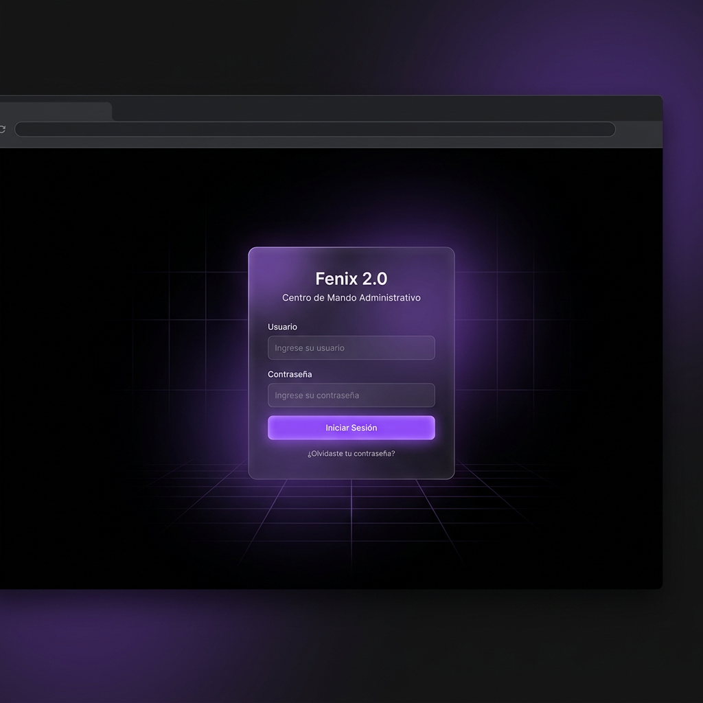
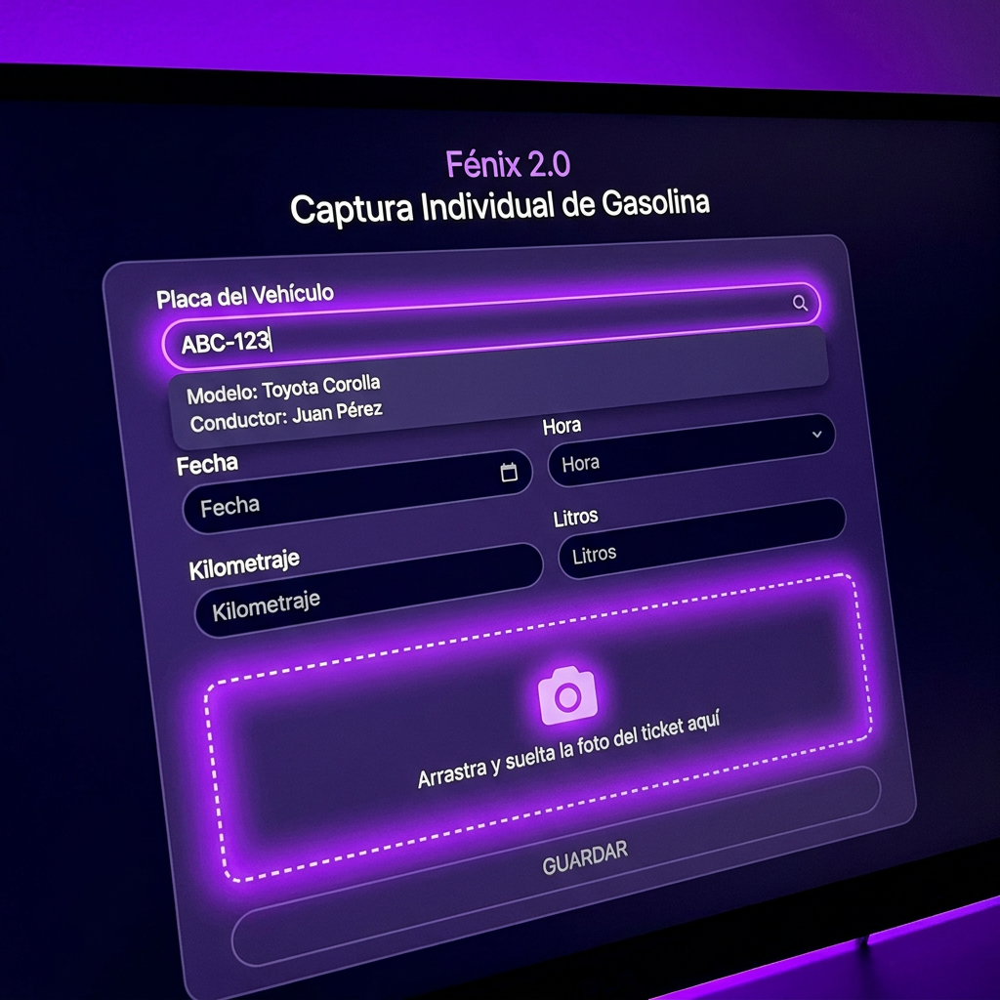
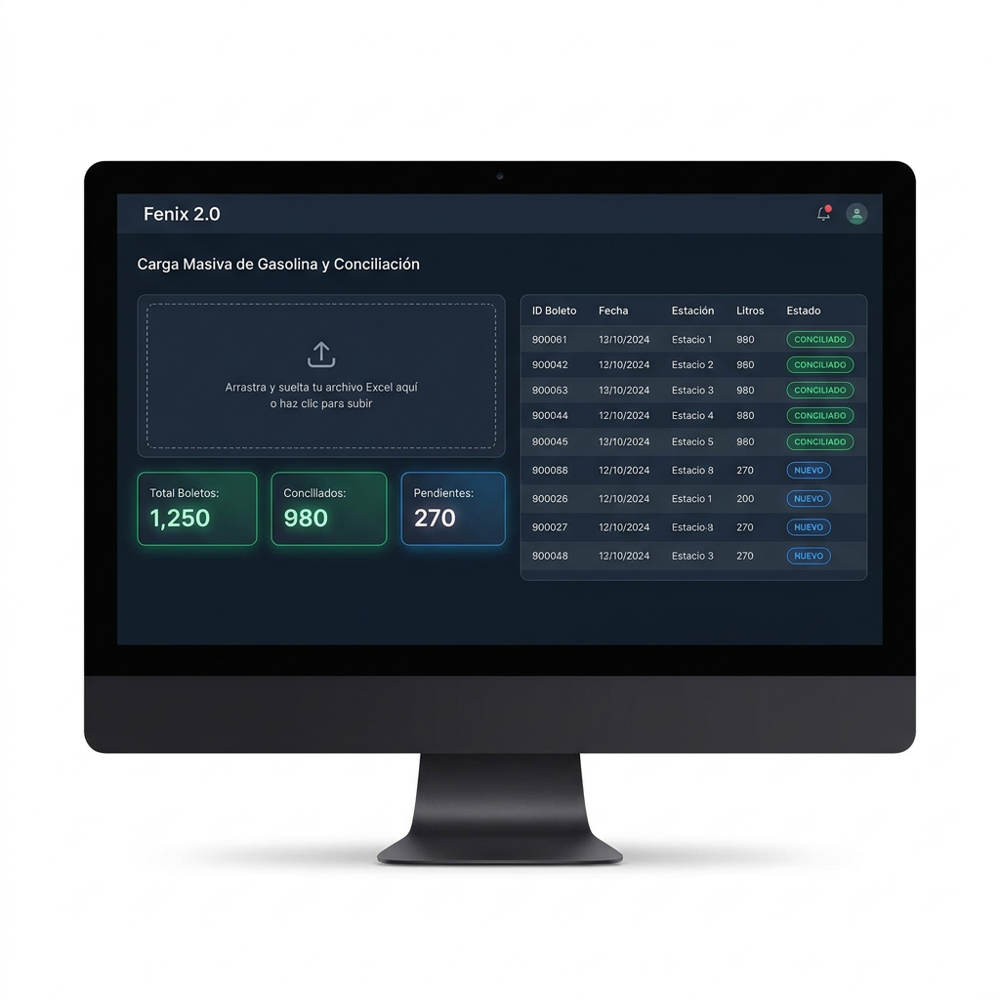

# 📖 MANUAL DE USUARIO Y GUÍA VISUAL DE OPERACIÓN PANTALLA POR PANTALLA
**Guía Paso a Paso con Capturas e Imágenes de Cada Módulo**
**Sistema Fénix 2.0 — Grupo Trujano**

---

| CONTROL DOCUMENTAL | INFORMACIÓN DE REGISTRO |
| :--- | :--- |
| **Código del Manual** | `MU-OP-001-FENIX` |
| **Título** | Manual de Usuario y Guía de Operación Ilustrada |
| **Versión** | `2.0` (Agosto 2026) |
| **Destinatarios** | Operadores, Residentes de Obra, Capturistas, Contadores y Auditores ISO |

---

## 🌟 1. BIENVENIDO AL SISTEMA FÉNIX 2.0

El **Sistema Fénix 2.0** es la plataforma de trabajo diaria para el registro, control, conciliación y auditoría de combustibles (Diésel y Gasolina), acarreos de materiales, mezcla asfáltica y casetas de telepeaje.

### 💻 Direcciones de Acceso:
- **Portal de Captura Operativa (Obra/Campo)**: `http://localhost:5001`
- **Centro de Mando Administrativo (Dirección/Control)**: `http://localhost:5002`

---

## 🔑 2. INICIO DE SESIÓN Y CONTROL DE ACCESO (CENTRO DE MANDO 5002)

Para ingresar al Centro de Mando Administrativo, abre tu navegador web (Google Chrome o Edge) e ingresa a `http://localhost:5002`.

### 📝 Paso a Paso para Iniciar Sesión:
1. **Paso 1**: Ingresa tu **Usuario** asignado. *(Por razones de seguridad, las contraseñas son personales y confidenciales).*
2. **Paso 2**: Ingresa tu **Contraseña**.
3. **Paso 3**: Haz clic en el botón morado **`Ingresar al Sistema ➔`**.

### 👥 Perfiles de Usuario:
- **Administrador (`admin`)**: Acceso total para capturar, aprobar, modificar datos, cambiar cuotas de ingenieros y descargar reportes oficiales en Excel y PDF.
- **Usuario de Consulta (`consulta`)**: Acceso de **Solo Lectura**. Permite consultar todas las pantallas, deshabilitando automáticamente los botones de edición y exportación.

---

## ⛽ 3. MÓDULO DE GASOLINA

### 3.1 Captura Individual por Placa (Día a Día):

1. **Paso 1**: Selecciona la **Placa** del vehículo ligero en el combo selector (o elige `S/P` para Equipos Menores).
2. **Paso 2**: El sistema **autocompletará en 0 milisegundos** el Vehículo, el Conductor Responsable y la Obra Destino.
3. **Paso 3**: Ingresa los Litros cargados y el Importe ($).
4. **Paso 4**: Adjunta la foto del ticket o pégala presionado `Ctrl+V`.
5. **Paso 5**: Haz clic en **`Guardar Consumo Gasolina`**.

---

### 3.2 Captura Masiva y Conciliación desde Excel (Gasolinería Levet / JDJ):

1. **Paso 1**: Haz clic en la pestaña **`📊 Captura Masiva / Conciliación Excel`**.
2. **Paso 2**: Arrastra el archivo Excel de la gasolinería (ej. `CONTROL JDJ PROVISIONAL.xlsx`).
3. **Paso 3**: En **0.3 segundos**, el sistema separará las cargas por **Semana ISO** (`Semana 26` a `Semana 31`) y mostrará el análisis de conciliación:
   - **`✔ CONCILIADO`** *(Etiqueta Verde)*: Cargas que ya existen previamente en la base de datos.
   - **`🆕 NUEVO`** *(Etiqueta Azul)*: Cargas que faltan en la base de datos.
4. **Paso 4**: Usa los filtros por **Semana** o por **Estado**.
5. **Paso 5**: Haz clic en el botón verde **`💾 Guardar Cargas Nuevas Seleccionadas`** para almacenar en lote todas las cargas faltantes en la base de datos.

---

## 🛢️ 4. MÓDULO DE DIÉSEL Y LECTURA DE BITÁCORAS PDF

### 📝 Paso a Paso para Capturar Consumos de Maquinaria Pesada:
1. **Paso 1**: Selecciona la **Obra / Frente de Trabajo** (*Alfredo del Mazo, Lerma-Tres Marías, México-Toluca, etc.*).
2. **Paso 2**: Selecciona el **Equipo Económico** de la máquina (*Pavimentadora PV-01, Retroexcavadora RET-03, etc.*).
3. **Paso 3**: Ingresa los litros entregados por la **Marimba/Pipa** y el costo por litro.
4. **Paso 4 (Lectura Inteligente PDF)**: Arrastra una bitácora en PDF y el sistema extraerá automáticamente el listado de máquinas y litros cargados.
5. **Paso 5**: Presiona **`Guardar Consumo Diésel`**.

---

## 📊 5. CENTRO DE MANDO ADMINISTRATIVO Y RESUMEN GENERAL

### 5.1 Interpretación del Flujo de Trabajo (Pipeline de 4 Tarjetas):
La pantalla de **Resumen General** (`http://localhost:5002/admin/resumen`) muestra el ciclo de vida del combustible mediante 4 tarjetas:
1. **📋 Autorizado**: Presupuesto de diésel o gasolina aprobado para la semana.
2. **📝 Solicitado**: Litros pedidos por los residentes de obra vía WhatsApp.
3. **🧾 Facturado**: Litros surtidos por la gasolinería a la Marimba en factura CFDI.
4. **⚙️ Consumido**: Litros reales entregados a los tanques de las máquinas y vehículos.

---

### 5.2 Cambio de Módulos (Diésel, Gasolina, Acarreos, Mezcla):
Utiliza las pestañas con estilo *Glassmorphism Oscuro*:
- **`🛢️ Diésel`**: Balance de diésel por obra y responsable.
- **`⛽ Gasolina`**: Consumos de vehículos ligeros.
- **`🚛 Acarreos`** y **`🏗️ Mezcla`**: Viajes de materiales, fresado y mezcla asfáltica.

---

### 5.3 Generación de Reportes Oficiales en Excel y PDF (Regla 6D vs 5D):
1. **Paso 1**: Selecciona el **Periodo / Semana ISO** (ej. `Semana 31`).
2. **Paso 2**: Haz clic en **`📊 Excel`** para descargar la planilla contable.
3. **Paso 3**: Haz clic en **`📄 PDF`** para descargar el reporte impreso con divisiones oficiales:
   - **SECCIÓN 1 (6 DÍAS)**: Responsables de Lunes a Sábado (*Apolinar, Francisco Javier, Ing. Diego Carreola, Jack, Luis*).
   - **SECCIÓN 2 (5 DÍAS)**: Responsables de Lunes a Viernes (*Dayanne, Edgar, Samuel*).
   - **Área de Firmas**: Firma de Elaboró, Revisó y Aprobó.

---

## 🧾 6. AUDITORÍA DE FACTURAS Y COMPLEMENTOS DE PAGO SAT

Ubicación: `http://localhost:5002/admin/facturas`.

1. **Paso 1**: Sube los archivos **XML (CFDI)** y **PDF** entregados por la gasolinería.
2. **Paso 2**: El sistema extraerá el **Folio Fiscal UUID**, emisor, subtotal, IVA y total.
3. **Paso 3**: Vincula la factura con la carga de la Marimba.
4. **Paso 4**: Carga el **Complemento de Pago (REP)** del SAT para actualizar el estatus a **`PAGADA`**.

---

## 📑 7. PREGUNTAS FRECUENTES Y SOLUCIÓN DE PROBLEMAS

### ❓ ¿Por qué las contraseñas no se incluyen en los manuales?
- Por normativa estricta de seguridad ISO 27001 e ISO 9001. Las contraseñas son confidenciales y gestionadas por el Administrador de Sistemas.

### ❓ ¿Cómo abro este documento en Google Drive / Google Docs?
- Simplemente arrastra el archivo HTML generado (`manual_de_usuario_y_operacion_fenix.html`) o el archivo `.md` a tu Google Drive, haz clic derecho y selecciona **Abrir con Google Docs**.
