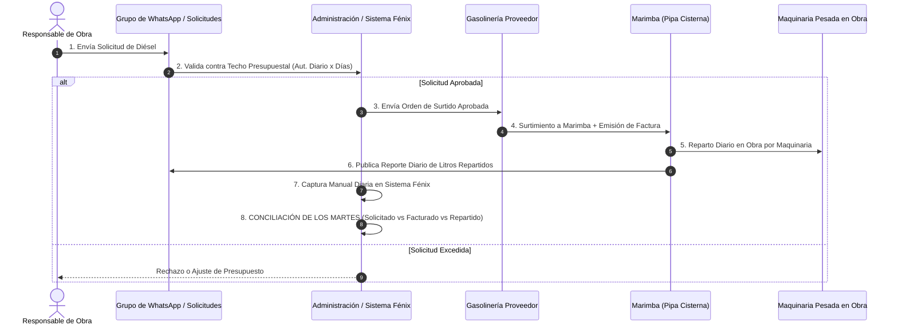

# 📘 MANUAL OPERATIVO Y ARQUITECTURA DE PROCESOS — SISTEMA FÉNIX 2.0
**Alineación Estratégica con Normas Internacionales ISO 9001 (Gestión de Calidad) e ISO 14001 (Gestión Ambiental)**

---

## 1. 🎯 INTRODUCCIÓN Y ALCANCE

El **Sistema Fénix 2.0** es la plataforma integral de gestión, control y conciliación de combustible (Diésel y Gasolina), acarreos, mezcla asfáltica y telepeaje para **Grupo Trujano**.

El presente documento establece los procesos operativos reales de campo, la arquitectura de datos, los formatos físicos/digitales normados y la estructura del sistema con el propósito de servir como **Manual Operativo Oficial** para las auditorías de certificación en:
- **ISO 9001 (Gestión de Calidad)**: Garantizando la trazabilidad 100% de cada litro consumido, la conciliación matemática del "Tríptico de Diésel" (Solicitado vs Facturado en Marimba vs Repartido por Maquinaria) y el registro inalterable de auditoría (*Audit Log*).
- **ISO 14001 (Gestión Ambiental y Control de Hidrocarburos)**: Garantizando el control riguroso sobre el uso eficiente de combustibles fósiles, prevención de fugas o consumos anómalos y monitoreo del desempeño de la flota de maquinaria y vehículos.

---

## 🔄 2. FLUJO DE TRABAJO OPERATIVO REAL DE DIÉSEL (PASO A PASO)

El proceso de suministro de diésel a la maquinaria de obra sigue un flujo estricto de 6 etapas operativas:

---

### 📋 Detalle Operativo de las 6 Etapas:

1. **Paso 1: Solicitud de Combustible (Grupo de WhatsApp)**:
   - Los responsables de obra (*Apolinar, Ing. Diego Carreola, Francisco Javier, Jack, Luis, etc.*) envían diariamente sus requerimientos de diésel a través del **Grupo de WhatsApp de Solicitudes**.

2. **Paso 2: Validación Presupuestal y Autorización**:
   - La administración compara la solicitud contra el **Techo Autorizado Diario y Semanal** del responsable en la base de datos (sección de 6 Días o 5 Días trabajados).
   - Si la solicitud está dentro del presupuesto aprobado, se autoriza.

3. **Paso 3: Suministro de Gasolinería a la "Marimba" + Facturación**:
   - Con la autorización emitida, la **Gasolinería proveedora** surte el volumen de diésel al camión cisterna/pipa conocido como **"La Marimba"**.
   - La gasolinería emite la **Factura CFDI** por el total de litros suministrados a la Marimba.

4. **Paso 4: Reparto Diario en Obra por Maquinaria**:
   - La Marimba acude a las distintas obras y frentes de trabajo (*Alfredo del Mazo, Lerma-Tres Marías, México-Toluca, Desasolve, Bacheo, etc.*) y reparte el diésel directamente al tanque de cada máquina pesada (*Pavimentadoras, Perfiladoras, Retroexcavadoras, Vibrocompactadores, Pipas, etc.*).
   - El operador de la Marimba reporta en el grupo de WhatsApp el desglose diario de litros entregados **por obra, por máquina y por número económico**.

5. **Paso 5: Captura Diaria en el Sistema Fénix**:
   - El administrador/capturista toma los reportes diarios de la Marimba enviados por WhatsApp e ingresa manualmente las cargas en el **Portal de Captura Fénix (Puerto 5001)** en el Módulo de Diésel.

6. **Paso 6: Conciliación Semanal de los Martes**:
   - Todos los días **Martes**, se realiza el proceso crítico de conciliación cruzando 3 elementos:
     - **A) Lo Solicitado / Autorizado por Obra**.
     - **B) Lo Facturado por la Gasolinería a la Marimba**.
     - **C) Lo Repartido por la Marimba y Registrado por Maquinaria en Fénix**.

---

## 🏗️ 3. ARQUITECTURA DEL SISTEMA Y BASE DE DATOS

El Sistema Fénix 2.0 opera mediante una arquitectura distribuida de doble portal conectada a una base de datos centralizada PostgreSQL (`fenix_db`).

### 🔌 Portales del Sistema:
1. **Portal de Captura Operativa (Puerto 5001)**: `http://localhost:5001`
   - **Módulo Diésel**: Captura de cargas diarias por maquinaria/obra reportadas por la Marimba.
   - **Módulo Gasolina**: Captura por placa ligera y **Captura Masiva Excel de Gasolinerías (Levet/JDJ)** con separación automática por semana e identificación de duplicados vs nuevos.
   - **Módulos Jalisco, Solicitudes, Acarreos y Mezcla**.
2. **Centro de Mando Administrativo (Puerto 5002)**: `http://localhost:5002`
   - Generación de reportes ejecutivos en Excel y PDF.
   - Reporte de **Consumo Semanal por Ingeniero** dividido en **Sección 6 Días** (`Aut. Diario × 6`) vs **Sección 5 Días** (`Aut. Diario × 5`).
   - Auditoría de Complementos de Pago SAT (UUIDs) y registro de auditoría inalterable (`catalogos.audit_log`).

---

## 📁 4. FORMATOS OFICIALES, PLANILLAS Y ARCHIVOS DE RESPALDO

Para la ISO 9001 e ISO 14001, el sistema cuenta con un catálogo estructurado de formatos estandarizados de control físico y digital:

### A. Formatos Físicos de Control Interno (Codificación GC-COMB):
- **`GC-COMB-003` (Formato Físico Semanal de Obra Diésel)**: Registro de control de vales y firmas en campo para diésel de obra.
- **`GC-COMB-004` (Formato Físico Semanal de Planta Asfáltica)**: Registro de suministro de combustible para quemadores y plantas.
- **`GC-COMB-005` (Control de Tanque de Combustible / Tanque Pegaso)**: Bitácora de entradas, salidas y existencias físicas del tanque principal.
- **`GC-COMB-006` (Formato de Captura de Operador Semanal)**: Control individual por operador de maquinaria pesada.
- **`GC-COMB-3.1` (Excel Maestro Control de Combustible Grupo Trujano)**: Planilla maestra consolidada para auditorías internas.
- **`GC-MAT-1.0` (Maestro Consolidado de Materiales y Acarreos)**: Registro de volúmenes de acarreos y fresado.

### B. Respaldos de Estructura de Base de Datos (Dumps SQL):
- **`fenix_schema.sql`**: Esquema base de la estructura de tablas relacionales.
- **`fenix_v2_schema.sql`**: Esquema actualizado con módulos de auditoría, conciliación y autorizaciones por días trabajados.
- **`schema.sql`**: Definición de secuencias, triggers y constraints de integridad.

### C. Archivos Maestros de Control y Conciliación:
- **`CONTROL JDJ PROVISIONAL (1).xlsx`**: Archivo mensual de cargas de la gasolinería Levet utilizado para la Captura Masiva y Conciliación de Gasolina.
- **`MAESTRO_CONTROL_DIESEL_NUEVO.xlsx`**: Respaldo consolidado de consumos de diésel por máquina y obra.
- **`MAESTRO_CONTROL_GASOLINA_NUEVO.xlsx`**: Respaldo consolidado de consumos de gasolina por unidad y placa.
- **`CONTROL_MAESTRO_TAGS.xlsx`**: Control de telepeaje y casetas por vehículo y obra.

---

## 📌 5. DIAGNÓSTICO DE PESTAÑAS: ACTIVAS VS FALTANTES / PROPUESTAS ISO

| Módulo / Pestaña | Estado Actual | Función Operativa | Requisito ISO |
| :--- | :---: | :--- | :--- |
| **Diésel - Captura Diaria** | ✅ ACTIVA | Registro de cargas diarias por maquinaria reportadas por la Marimba. | ISO 9001 (Trazabilidad) |
| **Diésel - Facturas y SAT** | ✅ ACTIVA | Carga de facturas XML/PDF de gasolinerías y Complementos SAT. | ISO 9001 (Control Contable) |
| **Gasolina - Captura Individual** | ✅ ACTIVA | Registro de gasolina por placa/unidad ligera con autocompletado en 0ms. | ISO 9001 (Control de Flota) |
| **Gasolina - Captura Masiva Excel** | ✅ ACTIVA | Carga de Excel mensual (Levet), desglose por semanas y conciliación BD. | ISO 9001 (Control de Proveedores) |
| **Solicitudes** | ✅ ACTIVA | Módulo de aprobación de presupuestos y saldos por responsable. | ISO 9001 (Autorización) |
| **Acarreos y Mezcla** | ✅ ACTIVA | Control de viajes, cubicaje y mezcla asfáltica producida/aplicada. | ISO 9001 (Control de Producto) |
| **Tags / Telepeaje** | ✅ ACTIVA | Conciliación de estados de cuenta de casetas (Pásalo, IAVE, etc.). | ISO 9001 (Gastos Operativos) |
| **Conciliación Semanal de los Martes** | ⚠️ *PROPUESTA* | Pestaña especial para cruzar automáticamente **Solicitado vs Facturado en Marimba vs Repartido por Maquinaria**. | **ISO 9001 (Conciliación Automática)** |
| **Bot de WhatsApp / Integración** | ⚠️ *PROPUESTA* | Conexión automática (N8N/Telegram/WhatsApp) para leer las cargas de la Marimba sin captura manual. | **ISO 9001 (Automatización de Procesos)** |
| **Mantenimiento y Horómetros** | ⚠️ *PROPUESTA* | Desempeño de diésel por hora trabajada (Lts/Hr) por máquina. | **ISO 14001 (Eficiencia Energética)** |
| **Indicadores Ambientales CO₂** | ⚠️ *PROPUESTA* | Huella de carbono estimada por volumen de combustible consumido. | **ISO 14001 (Gestión Ambiental)** |

---

## 📝 6. RECOMENDACIONES PARA EL MANUAL DE OPERACIÓN ISO

1. **Procedimiento Escrito de Conciliación de los Martes**:
   - Documentar el "Tríptico de Diésel" como el control operativo oficial para evitar desviaciones entre el volumen comprado a la gasolinería y el volumen entregado por la Marimba a las máquinas.
2. **Control de Duplicados en Gasolina y Diésel**:
   - Destacar ante los auditores ISO 9001 el uso del **Motor de Conciliación Masiva Fénix**, el cual impide registrar dos veces el mismo ticket o factura de gasolinería.
3. **Control Ambiental ISO 14001**:
   - Utilizar las estadísticas de consumo semanal por responsable y obra para demostrar ante la auditoría ambiental el control y reducción sistemática del desperdicio de diésel y gasolina.

---
*Documento actualizado con el flujo operativo real de solicitudes, suministro a Marimba, captura diaria, formatos GC-COMB y respaldos de base de datos.*
